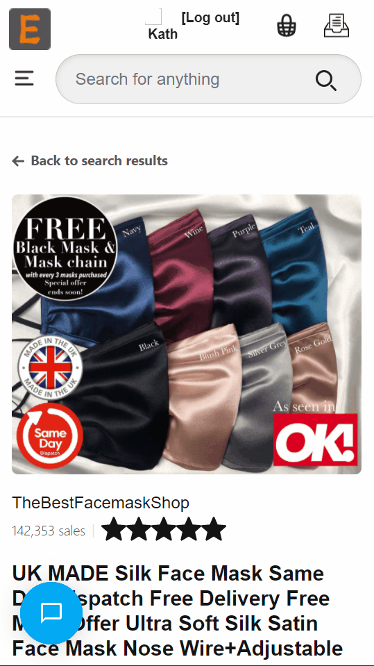
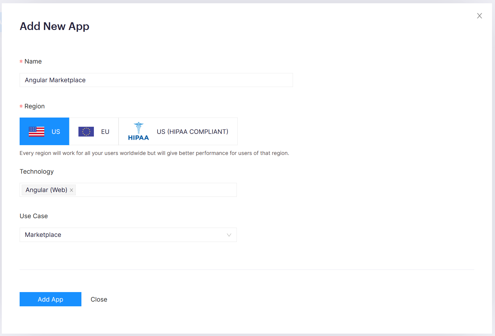

# Marketplace Site With Angular (Etsy/Amazon Clone)
Read the full tutorial here:

    NOT PUBLISH YET

This example shows a marketplace app which allows buyers and sellers to chat with each other:

  
  Desktop Browser View
    
  
    
  Mobile View

## Technology
This demo uses:

* CometChat Pro Angular 2.2.1
* Angular Version 11
* Node JS  Version higher than 10

## Running the demo
To run the demo follow these steps:

1. [Head to CometChat Pro and create an account](https://www.cometchat.com/pro?utm_source=github&utm_medium=link&utm_campaign=angular-marketplace)
2. From the [dashboard](https://app.cometchat.com/signup?utm_source=github&utm_medium=link&utm_campaign=angular-marketplace), create a new app called "Angular Marketplace" as shown below:
  
3. Once created, go into your app and you will be presented a quick start page as below. Take note of the `APP ID`, `Region` and `Auth Key` values.
4. Download the repository [here](https://github.com/wizlee/angular-marketplace/archive/refs/heads/master.zip) or by running `git clone https://github.com/wizlee/angular-marketplace.git`. 
5. To run the final end result of this Etsy Angular Marketplace website, first change directory into `angular-marketplace/angular-marketplace-final` folder.
6. Open the folder in VS Code or any other modern text editor. 
7. Open the `angular-marketplace-final/src/CONSTS.ts` file. Replace the placeholder values with the the `APP ID`, `Region` and `Auth Key` values.
8. Run the app by running `npm install` followed by `npm start`. 
9. For more details, please refer to the full tutorial.

## Useful links

- 🏠 [CometChat Homepage](https://www.cometchat.com/pro/?utm_source=github&utm_medium=link&utm_campaign=angular-marketplace)
- 🚀 [Create your free account](https://app.cometchat.com/signup/?utm_source=github&utm_medium=link&utm_campaign=angular-marketplace)
- 📚 [Documentation](https://prodocs.cometchat.com/?utm_source=github&utm_medium=link&utm_campaign=angular-marketplace)
- 👾 [GitHub](https://www.github.com/cometchat-pro)
